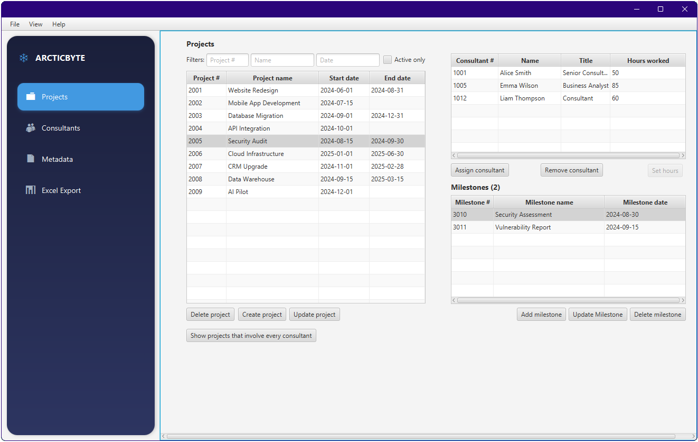

# Description

This was a group assigment for database course. 

The primary purpose of this system is to replace ArcticByte Consulting's current inefficient and
disorganized method of managing project information. The company's reliance on thousands of
individual Excel files stored on a server makes querying and data aggregation extremely
cumbersome, hindering strategic oversight and operational efficiency. This disorganized process
is a significant obstacle to the company's goal of becoming the number one consulting firm in the
country. Our application addresses this by introducing a centralized database solution, which
streamlines the fundamental business process of project data entry, management, and
aggregation.

